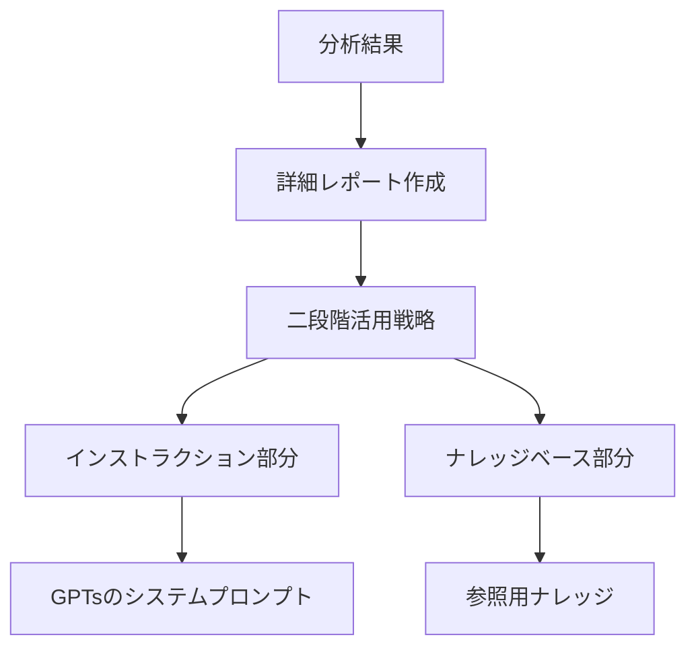

:::message
この記事では、ChatGPTを使って自分の文体を分析し、それを再現するAIライティングアシスタントを構築する方法について解説します。
:::

## はじめに

文章作成は多くの場合、時間と労力を要する作業です。
特に定期的に記事を執筆する場合、毎回ゼロから書き始めることに負担を感じることがあります。
「書きたいことはあるんだけど考えをまとめるのが大変だな」「目次からざっと骨子を考えてしまいたいな」と思うことが私は多く、かねてから課題を感じていました。

とはいえ、昨今の ChatGPT の進歩も目を見張るものがあります。
少しのプロンプトで大量の文章を生成してくれるようになってきていますし、メモリーに自分のプロンプトを記憶しておいて活用してくれる場合もあります。
これを踏まえると、AIを活用した文章生成も一つの解決策です。
が、生成された文章が自分の文体と異なると、修正に時間がかかり、結果的に効率が下がることもある、という課題を抱えていました。

この記事では、ChatGPTに自分の文章の特徴を分析してもらい、その結果をもとにカスタマイズしたAIライティングアシスタントを構築する方法を紹介します。
このアプローチにより、自分の文体に近い文章を効率的に生成することが可能になります。

プロセスは主に以下の2つのステップで構成されています:

1. **Deep Research による文章スタイルの分析**
2. **GPTs による専用AIライティングアシスタントの構築**

## ステップ 1: Deep Research による文章スタイルの分析

最初のステップでは、過去に書いた記事やコンテンツのデータを Deep Research に入力し、文章の傾向を分析します。

### Deep Research 選定の理由

:::details 文章分析手法の比較
文章の特徴を分析する方法には複数のアプローチがあります：

- **RAG方式**: 全ての記事をそのままデータとして利用し、AIに検索させる
- **手動分析**: 自分で文章の特徴を抽出する
- **Deep Research**: AIが文章の特徴を体系的に分析する

RAG方式は個々の表現やスタイルの再現には有効ですが、文体の本質や論理構成の特徴を抽出するには限界があります。
:::

Deep Research を選んだ理由は、テキストを抽象化・整理し、文章のトーンや表現方法を体系的に分析できる点にあります。文章の構造、トーン、頻出単語のパターンなどを整理することで、文体の特徴を客観的に把握することができます。

### 実施手順

#### 1. Deep Research への分析依頼

分析対象として以下のデータを用意しました：

- 過去に執筆した技術記事（Markdown 形式）
- ブログやノートの技術メモ
- 技術関連のSNS投稿

分析結果として以下のような項目が抽出されました：

   | 分析項目 | 内容 |
   | ---- | ---- |
   | 語彙の特徴 | 専門用語とカジュアル表現のバランス |
   | 文法構造 | 文章の長さ、改行の頻度、句読点の使い方 |
   | トーン | 丁寧語とカジュアル表現の割合、ユーモアの挿入頻度 |
   | 論理展開 | 記事の構成、段落の流れ、見出しの付け方 |
   | カテゴリー | Web開発、クラウド技術、CI/CD など |

#### 2. 分析結果の整理と活用

分析結果を得た後は、それを実用的な形に整理することが重要です。以下の手順で進めました：

まず、Deep Researchの分析結果をテキストファイルにまとめ、各項目について詳細なレポートを作成しました。例えば「カジュアルだけど情報は正確」という特徴について、具体的な表現パターンや文章構造を特定します。

:::message
分析結果の例：
- 文章はカジュアルな表現を用いつつも、情報の正確性を重視している
- 技術用語には適宜説明を入れる傾向がある
- ユーモアは控えめに、文脈に合わせて挿入している
:::

次に、この詳細レポートを二段階で活用する方法を検討しました：

- **インストラクション部分**: 文体の基本的な特徴（文の長さ、接続詞の使い方など）をGPTsのシステムプロンプトに組み込む
- **ナレッジベース部分**: 専門用語の説明スタイルや具体例の出し方などの詳細な特徴を、参照用ナレッジとして保存

この二段階アプローチを採用した理由は、文章の状態に応じて必要となる知識が変わるためです。例えば技術的な説明部分では「専門用語の説明スタイル」のナレッジを参照し、結論部分では「まとめ方のパターン」を参照するといった使い分けが可能になります。

これにより、単に文体を模倣するだけでなく、文章の目的や状況に応じて適切な知識を活用できるアシスタントを構築することができました。

## ステップ 2: GPTs による文体再現の実装

Deep Research で得た分析結果を活用し、ChatGPT の **GPTs** にカスタムインストラクションを設定して文体の再現を試みました。

### GPTs 選定の理由

文体を再現するためのアプローチとして、GPTs を選んだ主な理由は、システムプロンプトを一度設定すれば同じ条件で継続的に利用できる点にあります。

毎回プロンプトを手動で設定する方法と比較すると、GPTs では一貫した文体を維持しやすく、効率的に文章を生成できるメリットがあります。

### 構築する上での課題

GPTs を実装する過程でいくつかの課題が明らかになりました：

#### 1. フィードバックの学習機能の不足

文章生成時に与えたフィードバックをGPTsが学習する機能がないため、同じ修正を繰り返し行う必要がありました。これは長期的な利用において効率面での課題となります。

#### 2. 自己学習機能の欠如

一部の自律型エージェントには、フィードバックを蓄積して次回以降の生成に活かす機能がありますが、GPTsにはそのような機能がありません。より高度な学習プロセスを実現するには、別のアプローチが必要かもしれません。

:::details 代替ツールの検討
- **Claude AI**: カスタムプロンプトの保存機能を備えている
- **Perplexity**: 情報検索と文章生成を組み合わせることができる
- **自律型エージェント**: フィードバックの学習機能があるが、設定はより複雑
:::

### GPTs の設定方法

実際に私が構築したAIライティングアシスタントの設定方法を紹介します。以下の手順で、自分の文体を再現するGPTsを作成することができます。主にやることは以下です。

:::message
1. **GPTs の作成**
2. **基本情報の設定**
3. **システムプロンプトの設定**
    - 「Instructions」タブでDeep Researchの分析結果をそのまま入力します。
4. **ナレッジの追加**:
    - Deep Research で出てきた各分析項目を詳細に記載したファイルを添付する
5. **能力の設定**
    - 必要に応じて。私は全て許可してます
6. **テストと調整**
:::

記事執筆時の様子。GPTs である程度骨子を作成したのち、Cursor などに投入して文章を細かく整形していくことで内容をブラッシュアップしていけるようになりました。

## まとめ

この記事では、自分の文体を分析し、それを再現するAIライティングアシスタントを構築する方法を紹介しました。主なステップは以下の通りです：

1. **Deep Researchによる文章スタイルの分析**
   - 過去の文章データの収集と分析
   - 分析結果の詳細レポート化

2. **GPTsによる専用AIライティングアシスタントの構築**
   - 基本的な文体特徴のシステムプロンプトへの組み込み
   - 詳細な特徴のナレッジベース化

今後の展望としては、フィードバックを学習できるAIツールの活用や、トレンドを自動で取り入れる仕組みの導入により、より高度な執筆支援システムの構築が考えられます。

このようなアプローチにより、文章作成の効率化と質の向上の両立が可能になります。

